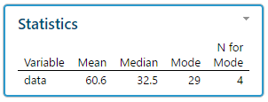
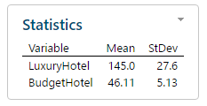
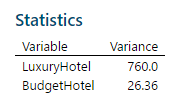

```{r setup, include=FALSE}
knitr::opts_chunk$set(echo = TRUE)
library(readxl)
library(ggplot2)
```

# Problem 3.14

## Read data set

```{r}
prob <- read_excel("Excel/CH03/ex3-14.xlsx")
prob$data <- as.numeric(prob$data)
```

## EDA 

```{r, warning=FALSE}
ggplot(data=prob, aes(x=data)) +
  geom_histogram() +
  labs(title = "Histogram of Data") +
  labs(caption = "(Source: Statistical Methods & Data Analysis)") 
```

## Compute Mean, Median, Mode

```{r, echo=FALSE}
getmode <- function(v) {
   uniqv <- unique(v)
   uniqv[which.max(tabulate(match(v, uniqv)))]
}
```

The mean of the data set is: `r round(mean(prob$data),2)`

The median of the data set is: `r round(median(prob$data),2)`

The mode of the data set is: `r getmode(prob$data)`




# Problem 3.31

## Read data set

```{r}
prob <- read_excel("Excel/CH03/ex3-31.xlsx")
prob$LuxuryHotel <- as.numeric(prob$LuxuryHotel)
prob$BudgetHotel <- as.numeric(prob$BudgetHotel)
prob$LuxuryHotel <- as.numeric(prob$LuxuryHotel)
prob$BudgetHotel <- as.numeric(prob$BudgetHotel)
```

## Compute mean and standard deviation of the room rate for luxury hotels

The mean of the data set is: `r round(mean(prob$LuxuryHotel, na.rm=TRUE), 2)`

The standard deviation of the data set is: `r round(sd(prob$LuxuryHotel, na.rm=TRUE), 2)`

```{r}
mean(prob$LuxuryHotel, na.rm=TRUE)
sd(prob$LuxuryHotel, na.rm=TRUE)
```

## Compute mean and standard deviation of the room rate for budget hotels


The mean of the data set is: `r round(mean(prob$BudgetHotel, na.rm=TRUE), 2)`

The standard deviation of the data set is: `r round(sd(prob$BudgetHotel, na.rm=TRUE), 2)`

```{r}
mean(prob$BudgetHotel, na.rm=TRUE)
sd(prob$BudgetHotel, na.rm=TRUE)
```



## Variance

The variance of the data set is: `r round(var(prob$LuxuryHotel, na.rm=TRUE), 2)`

The variance of the data set is: `r round(var(prob$BudgetHotel, na.rm=TRUE), 2)`



```{r}
ggplot(data=prob, aes(x="Luxury", y=prob$LuxuryHotel)) +
  geom_boxplot() +
  xlab("") +
  ylab("Luxury Hotel Price")
ggplot(data=prob, aes(x="Budget", y=prob$BudgetHotel)) +
  geom_boxplot() +
  xlab("") +
  ylab("Budget Hotel Price")
```


## Variablity Reason

The coefficient of variation for Luxury hotel is `r round(sd(prob$LuxuryHotel, na.rm=TRUE)/mean(prob$LuxuryHotel, na.rm=TRUE)*100, 2)`

The coefficient of variation for Budget hotel is `r round(sd(prob$BudgetHotel, na.rm=TRUE)/mean(prob$BudgetHotel, na.rm=TRUE)*100, 2)`

## Measure of Variablity

The dataset for budget hotels and luxury hotels are from two different populations so standard deviation does not provide a good comparison of the variability. Coefficient of variability (CV) does provide a better comparison because it takes into account the larger difference in the means between both budget and luxury hotels.

# Problem 3.33

## Read data set

```{r}
prob <- read_excel("Excel/CH03/ex3-33.xlsx")
prob$Data <- as.numeric(prob$Data)
```

## Boxplot

```{r}
ggplot(data=prob, aes(x="", y=prob$Data)) +
  geom_boxplot() +
  labs(title = "Boxplot of Data") +
  labs(caption = "(Source: Statistical Methods & Data Analysis)") +
  xlab("") +
  ylab("Measurement")
```

# Problem 4.16

## Read data set

```{r}
prob <- read_excel("Excel/CH04/ex4-16.xlsx")
prob
```


## P(Asian) U P(Type A)

The probability is `r prob[3,3] * 100` %
```{r}
prob[3,3] * 100
```

## P(White) - (P(White) U P(Type A))

The probability is `r (sum(prob[1,2:5]) - prob[1,3]) * 100` %
```{r}
(sum(prob[1,2:5]) - prob[1,3]) * 100
```

## P(Asian) U P(Type A) + P(Asian) U P(Type B)

The probability `r sum(prob[3,3:4]) * 100` %
```{r}
sum(prob[3,3:4]) * 100
```

## P(Type O) + P(Type B)

The probability `r (sum(prob[,2]) + sum(prob[,4])) * 100` %
```{r}
(sum(prob[,2]) + sum(prob[,4])) * 100
```

# Problem 4.30

```{r}
#Let D = event that loan defaulted
#Let !D = event that loan did not defaulted

#Let R1 = applicant has poor risk
#Let R2 = applicant has fair risk
#Let R3 = applicant has good risk

#P(D)
default <- .01
#P(!D)
non_default <- 1 - default

#P(R1|D)
default_poor_risk <- .3
#P(R2|D)
default_fair_risk <- .4
#P(R3|D)
default_good_risk <- .3

#P(R1|!D)  
nondefault_poor_risk <- .1
#P(R2|!D)  
nondefault_fair_risk <- .4
#P(R3|!D)  
dnonefault_good_risk <- .5


# Posterior probality of default given a fair risk 
#P(D | R2) 

x <- default_fair_risk * default
y1 <- default_fair_risk * default
y2 <- nondefault_fair_risk * non_default

result <- x / (y1 + y2)
result

# Prior probality of default
#P(D)
default
```
